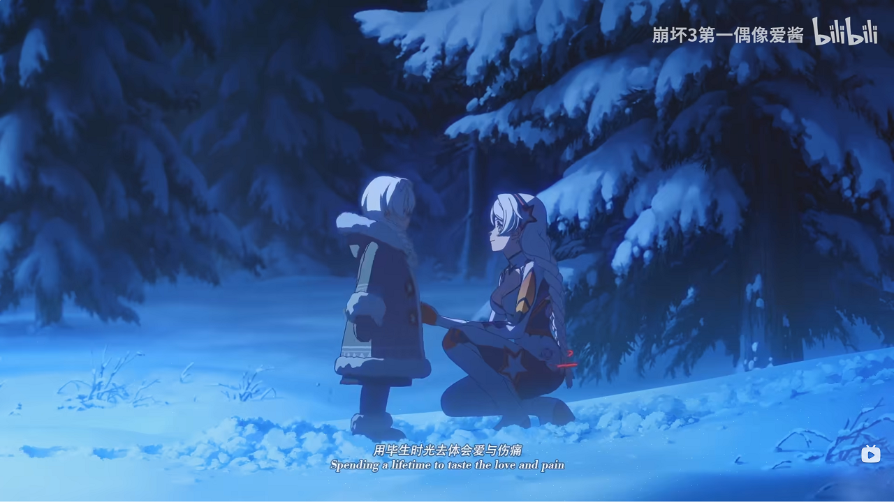

import BilibiliVideo from '@site/src/components/BilibiliVideo'

> 如果电影真的有改变观众的力量，那我想把它的力量用在美好和正确的事上。 
> 
——新海诚

上周五在刷B站的时候，看到我关注的一位UP发布了一个关于电影《铃芽之旅》的视频。说实话一般我很少看这种关于电影解析的视频，除非是那种我看完后特别感兴趣的电影才会去搜来看看。但是由于这位UP的特殊属性，二次元、游戏及其特殊的视频风格，我还是点进去看完了。

<!--truncate-->

<BilibiliVideo bv="BV1nX4y1o7ar" />

看完之后：

- 哦，原来是《你的名字》、《天气之子》的续作啊！
- 哦，原来是有名的新海诚的新电影啊！
- 哇，UP主讲的好好啊，感觉这个故事应该不错，赞！

基于以上原因，我决定去电影院看看。所以昨天趁着周末买了最近影院最后一场的票（为什么要买最后一场？因为人少安静，被影响观影体验的概率小很多，而且比较喜欢电影结束时凌晨大街上的那种安静）。

看完之后：

- 画面真不错，随便截图都能拿来当壁纸；
- 音乐真不错，和画面的配合简直无敌；
- 故事也不错，至少挺吸引我的，而且很能调动我的情绪。

如果没看之前那位UP的视频，那我看完后估计也就这么多感觉吧！但看完电影后我更加觉得UP讲的好了，感觉我就能看个热闹，根本看不出来那么多人文关怀，还是吃了没文化的亏。

结合电影、那位UP的视频以及我自己的一些理解，这里再总结下吧：

我们的过去可能经历过一些伤痛，这些伤痛甚至可能让我们对现实感到绝望。也许我们现在看起来像没事的普通人，但我们的内心却还像铃芽的日记一样，把那段伤痛的经历涂黑，让自己尽量不去回忆，但其实问题并没有解决。

不想活的人才不怕死，影片的最后主角们都想继续活下去，哪怕多一秒也好，是什么给了他们希望活下去的动力，是美好，是来自周围的点点善意。对铃芽来说就是男主、姨妈以及旅行路上遇到的人们。点点美好会在心中发芽，长成足以抵御过去伤痛的大树，给人以愿意继续活下去的勇气。人与人之间的联结真的很重要，有时只是简简单单的陪伴也会给人带来力量。

影片中多次提到门这一意象，甚至影片名直译过来也是“铃芽关门”。关上门，蚓厄就无法出逃，地震就不会发生。所以，当我们遇到无法抵御的伤痛的时候，不如先关上门，等到自己有能力去面对这一切的时候再去面对。

最后铃芽与小铃芽那段很令人感动，但是可能是前不久才看完崩坏3《毕业旅行》动画短片的缘故，那个场面总让我想起琪亚娜和小琪亚娜那段，是真的好像啊！

<BilibiliVideo bv="BV1Kj411g7Lu" />

里面有些话本来想摘抄出来的，但记忆力不太好，又不想去找盗版资源，所以等什么时候电影上线视频平台的时候再补上吧！

PS：
- 二次元的故事很美好，二次元的女孩子更美好。哈哈哈！
- 感觉自己的文字表达能力还得提升啊，写的这是什么玩意，自己都不满意。